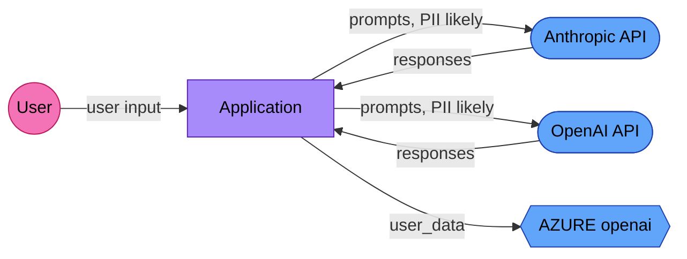

# AI Data Flow Analysis — EU AI Act Article 13 / GDPR Article 30

> Generated by AI Trace Auditor v0.10.0
> **This report maps detected data flows. Verify all entries before using for compliance.**

**Generated:** 2026-03-18 19:29 UTC
**Source directory:** `/Users/bipinrimal/Downloads/Website/Projects/neurodivergent-prompting`
**External services detected:** 3
**Data flows mapped:** 3

---

## Data Flow Diagram

**Legend:**
- 🟢 Green = Controller (you control the data)
- 🔵 Blue = Processor (third party processes on your behalf)
- 🟡 Yellow = Sub-processor
- ⬜ Gray = Unknown role

---

## External Services

| Service | Category | Type | GDPR Role | PII Risk | Location |
|---------|----------|------|-----------|----------|----------|
| Anthropic API | ai_provider | cloud_api | processor | likely | `/Users/bipinrimal/Downloads/Website/Projects/neurodivergent-prompting/api_clients.py:16` |
| OpenAI API | ai_provider | cloud_api | processor | likely | `/Users/bipinrimal/Downloads/Website/Projects/neurodivergent-prompting/api_clients.py:30` |
| AZURE openai | cloud | cloud_api | processor | unknown | `/Users/bipinrimal/Downloads/Website/Projects/neurodivergent-prompting/api_clients.py:30` |

---

## Data Flows

### application → Anthropic API

- **Data type:** prompts
- **Purpose:** inference
- **GDPR role:** processor
- **PII risk:** likely
- **Detected at:** `/Users/bipinrimal/Downloads/Website/Projects/neurodivergent-prompting/api_clients.py:16`

### application → OpenAI API

- **Data type:** prompts
- **Purpose:** inference
- **GDPR role:** processor
- **PII risk:** likely
- **Detected at:** `/Users/bipinrimal/Downloads/Website/Projects/neurodivergent-prompting/api_clients.py:30`

### application → AZURE openai

- **Data type:** user_data
- **Purpose:** storage
- **GDPR role:** processor
- **PII risk:** unknown
- **Detected at:** `/Users/bipinrimal/Downloads/Website/Projects/neurodivergent-prompting/api_clients.py:30`

---

## GDPR Article 30 — Record of Processing Activities

| Controller | Contact | DPO |
|-----------|---------|-----|
| [MANUAL INPUT REQUIRED] | [MANUAL INPUT REQUIRED] | [MANUAL INPUT REQUIRED] |

| Processing Activity | Purpose | Data Categories | Recipients | Transfers | Retention | Security |
|--------------------|---------|-----------------|-----------|-----------|-----------| ---------|
| Sending prompts to Anthropic API for AI inference | AI-powered content generation and analysis | User-generated text content (may contain personal data) | Anthropic API | Transfer to Anthropic API as processor | [MANUAL INPUT REQUIRED] | [MANUAL INPUT REQUIRED] |
| Sending prompts to OpenAI API for AI inference | AI-powered content generation and analysis | User-generated text content (may contain personal data) | OpenAI API | Transfer to OpenAI API as processor | [MANUAL INPUT REQUIRED] | [MANUAL INPUT REQUIRED] |
| Storing user_data in AZURE openai | Data persistence and retrieval | User records and associated data | AZURE openai | Transfer to AZURE openai as processor | [MANUAL INPUT REQUIRED] | [MANUAL INPUT REQUIRED] |

---

## Recommendations

1. **Verify PII classification** — Flows marked "likely" need Data Protection Impact Assessment (DPIA)
2. **Document legal basis** — Each processing activity needs a GDPR Article 6 legal basis
3. **Map data transfers** — Cross-border transfers (outside EEA) require additional safeguards
4. **Review processor agreements** — Each "processor" service needs a Data Processing Agreement (Article 28)
5. **Set retention periods** — All `[MANUAL INPUT REQUIRED]` retention fields must be completed

---

*Generated by [AI Trace Auditor](https://github.com/BipinRimal314/ai-trace-auditor) — open source under Apache 2.0*